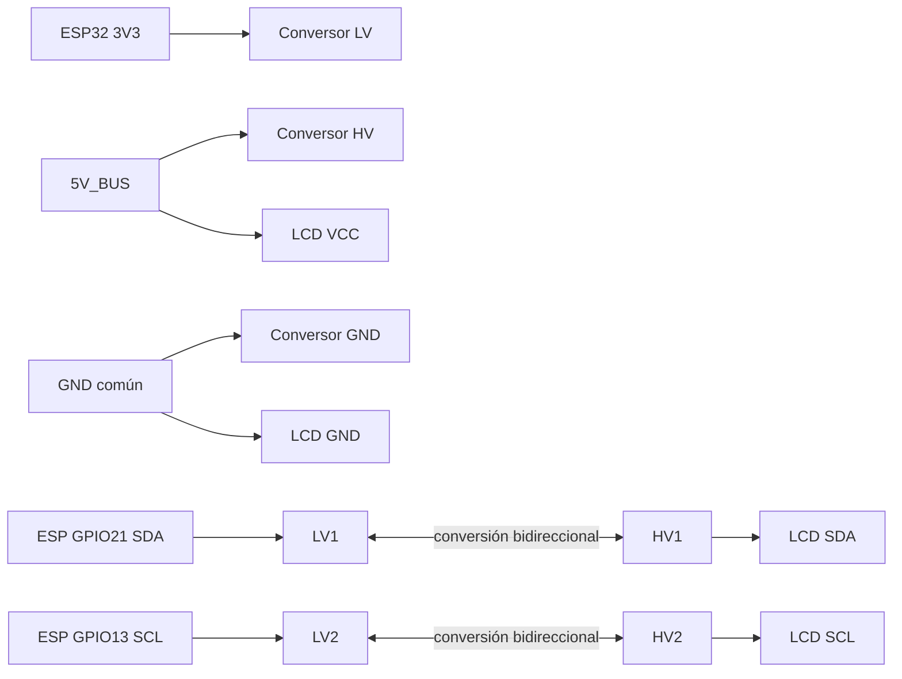

# Manual maestro de conexiones pin por pin

> [!DANGER]
> HISTÓRICO — NO CABLEAR. Usa `visualizaciones/domus-banco-final-s8050-ir.svg`
> y [[59 - Firmware unico y perfil banco S8050 IR]].

Este manual usa el inventario real: bomba de 3-6 V controlada directamente por
S8050 y diodo 1N4007. El rele azul queda reservado. GPIO5-8 quedan sin etapa y
bloqueados; la propuesta de cuatro reles queda retirada.

> [!DANGER]
> Este documento describe baja tensión DC. No llevar 120/230 V a la maqueta.
> Elegir **una sola** ruta de alimentación. No unir directamente fuente USB,
> batería y panel solar. Desenergizar antes de mover un cable.
> Decisión vigente: conectar únicamente la fuente común regulada de 5 V. Las
> rutas de batería/solar inferiores son históricas y no se montan. Usar el
> perfil corregido de bomba con S8050 de [[36 - Configuracion final 1 mas 4 reles y planos v4]].

Este es el esquema maestro de PROJECT DOMUS. Reúne alimentación, protección,
ESP32, sensores, botones, pantalla, relés, cargas, audio, microSD y la fase
solar. Los módulos todavía no comprados aparecen como **provisionales** y no se
deben fabricar en un mazo definitivo hasta verificar su serigrafía.

## Leyenda y reglas que no cambian

- `5V_BUS`: barra regulada de 5.0 V después de fusible e interruptor.
- `3V3`: salida de 3.3 V del ESP32, solo para lógica y sensores de bajo consumo.
- `GND`: referencia común de todos los módulos de señal.
- `NO CONECTAR`: el pin queda físicamente aislado.
- **No usar 5 V en ningún GPIO del ESP32-S3.**
- Bomba, ventilador, relés, WS2812 y MAX98357A toman energía de `5V_BUS`, no de
  `3V3`.
- Los contactos de relé conmutan solo cargas DC de la maqueta.
- Los cables de señales se separan de bomba, ventilador, altavoz y ramales de
  potencia.

## 1. Diagrama total de alimentación y señales

```mermaid
flowchart TB
    subgraph FUENTES[Elegir UNA ruta de entrada]
      PARED[Fuente regulada 5 V / 3 A]
      USB[USB 5 V de carga]
      PANEL[Panel solar 5–6 V verificado]
      USB --> TP[TP4056 protegido]
      TP --> BAT1[Una batería 1S protegida]
      BAT1 --> BOOST1[Elevador ajustado a 5.0 V]
      PANEL --> SOLAR[Cargador solar 1S CN3065 o equivalente]
      SOLAR --> BAT2[Pack 1S diseñado y protegido]
      BAT2 --> BOOST2[Elevador ajustado a 5.0 V]
    end

    PARED --> FUSE[Fusible general 3 A]
    BOOST1 --> FUSE
    BOOST2 --> FUSE
    FUSE --> SWITCH[Interruptor general]
    SWITCH --> BUS5[5V_BUS en estrella]
    PARED -. negativo .-> GND[GND común]
    BOOST1 -. OUT− .-> GND
    BOOST2 -. OUT− .-> GND

    BUS5 --> ESP5[ESP32-S3 pin 5V/VIN]
    BUS5 --> COIL[Bobina del rele 5 V]
    BUS5 --> LOAD5[Bomba, ventilador y luces 5 V]
    BUS5 --> LCD5[LCD1602 I2C]
    BUS5 --> AMP5[MAX98357A]
    BUS5 --> RGB5[WS2812]

    ESP5 --> V33[ESP32 pin 3V3]
    V33 --> SENSOR3[DHT + suelo + nivel + LDR]
    V33 --> MIC3[INMP441]
    V33 --> SD3[microSD compatible 3.3 V]
    V33 --> LV[LV del adaptador I2C]
    BUS5 --> HV[HV del adaptador I2C]

    ESP5 -->|GPIO15| SOIL[Suelo AO]
    ESP5 -->|GPIO16| WATER[Nivel AO, sin sensor]
    ESP5 -->|GPIO3| LDR[LDR divisor]
    ESP5 -->|GPIO9| SILENCIO[Switch MIC OFF]
    ESP5 -->|GPIO10 / 9 / 18| BTN[PARO / SILENCIO / DEMO]
    ESP5 -->|GPIO12 reservado| IR[Receptor IR HX1838]
    ESP5 -->|GPIO14| DHT[DHT DATA]
    ESP5 -.->|GPIO13 SCL; SDA libre (LCD quemado)| LEVEL[I2C sin periféricos]

    ESP5 -->|GPIO17 por 1 kOhm| Q1[S8050]
    Q1 --> COIL
    COIL --> R1[Contacto NO del rele]
    R1 --> LOAD5
    ESP5 -->|GPIO5 / GPIO8 / GPIO6| LEDS[LEDs Casa, Porche y Spare; activos en HIGH]
    ESP5 -.->|GPIO7| CULT[Cultivo: sin etapa fisica]
    ESP5 -.->|GPIO40 BCLK + 41 LRC + 42 DOUT propuestos| AMP5
    AMP5 --> SPK[Altavoz entre SPK+ y SPK−]
    ESP5 <-.->|GPIO38/39/47/48 SPI propuesto| SD3
    ESP5 -. GPIO por asignar .-> AHCT[74AHCT125]
    AHCT -->|330 ohm| RGB5
```

Las tres flechas de fuente llegan al mismo fusible para mostrar alternativas,
no conexiones simultáneas. La presentación inicial usa solo la fuente de pared.

## 2. Ruta de energía recomendada para construir y probar

### Fuente de pared, versión inicial

| Desde | Hacia | Cable / protección |
|---|---|---|
| Fuente `+5 V` | entrada del portafusible | 22 AWG rojo |
| salida del fusible 3 A | entrada del interruptor | 22 AWG rojo |
| salida del interruptor | barra `5V_BUS` | 22 AWG rojo |
| Fuente `GND/−` | barra `GND` | 22 AWG negro |
| `5V_BUS` | cada ramal con conector propio | 22 AWG para cargas; jumpers solo para señales |
| `GND` | cada ramal en estrella | retorno independiente para bomba/audio si es posible |

Colocar 1000 µF entre `5V_BUS` y `GND` cerca de relés/cargas, respetando
polaridad, más 100 nF cerca de cada módulo sensible. Medir 5.0 V antes de
insertar el ESP32.

### TP4056 y una celda 1S, solo fase de batería

| Pin típico del TP4056 protegido | Conexión exacta |
|---|---|
| `IN+` / USB VBUS | cargador USB de 5 V |
| `IN−` / USB GND | GND del cargador USB |
| `B+` | positivo de **una** celda/pack 1S compatible |
| `B−` | negativo de la misma celda/pack |
| `OUT+` | `IN+` del elevador a 5 V |
| `OUT−` | `IN−` del elevador a 5 V |
| elevador `OUT+` | fusible general, después interruptor |
| elevador `OUT−` | barra `GND` |

El TP4056 es cargador de una celda; no es un selector automático de fuentes.
Con este diseño se carga con la casa apagada. No poner dos TP4056 en paralelo,
no conectar una batería de 9 V y no ajustar el elevador con el ESP32 conectado.

### Solar, fase posterior y no cerrada sin el módulo físico

| Desde | Hacia |
|---|---|
| panel `PV+` | cargador solar `SOLAR+/VIN+` |
| panel `PV−` | cargador solar `SOLAR−/VIN−` |
| cargador `BAT+` | pack 1S protegido `B+` |
| cargador `BAT−` | pack 1S protegido `B−` |
| salida protegida del pack | elevador estable a 5.0 V |
| elevador `OUT+` | fusible → interruptor → `5V_BUS` |
| elevador `OUT−` | `GND` |

No conectar el panel directamente a batería, ESP32 o barra de 5 V. Los nombres
de pines cambian entre placas CN3065; antes de comprar o cablear hay que guardar
foto de ambas caras y hoja técnica. Si el módulo no tiene salida `LOAD`, no se
debe inventar una: batería y carga requieren una arquitectura de protección y
reparto verificada. La variante de panel 3 V/110 mA queda rechazada.

## 3. ESP32-S3 N16R8: alimentación y mapa completo

Usar la etiqueta impresa de la placa (`5V` o `VIN`, `3V3`, `GND`, `GPIOx`). La
posición física del header depende de la variante; no contar pines desde una
esquina sin comparar la serigrafía con el pinout del fabricante.

| Pin ESP32 | Conexión | Estado |
|---:|---|---|
| `5V/VIN` | `5V_BUS` | alimentación de placa |
| `GND` | barra `GND` | obligatorio |
| `3V3` | sensores/lógica 3.3 V | salida, no para motores |
| `GPIO1` | libre (el suelo ya no va aquí) | sin uso |
| `GPIO2` | libre (el nivel ya no va aquí) | sin uso |
| `GPIO3` | nodo del divisor LDR | activo |
| `GPIO4` | DRV8833 AIN1 (reserva; la bomba salió del DRV) | fuera del camino |
| `GPIO5` | LED Casa (2 azul) | activo, HIGH = ON |
| `GPIO6` | LED Spare (Jarvis) | activo, HIGH = ON |
| `GPIO7` | cultivo: sin etapa física | `SALIDA_FISICA=false` |
| `GPIO8` | LED Porche (2 azul) | activo, HIGH = ON |
| `GPIO9` | switch SILENCIO / MIC OFF a GND (antes PIR) | activo, `INPUT_PULLUP` |
| `GPIO10` | botón PARO a GND | activo, `INPUT_PULLUP` |
| `GPIO11` | no existe en la placa (nota 80) | no cablear |
| `GPIO12 reservado` | señal del receptor IR HX1838 | activo; no usar para algo más |
| `GPIO13` | I2C SCL, lado LV del adaptador | activo provisional |
| `GPIO14` | DATA DHT | activo |
| `GPIO15` | AO humedad de suelo | activo; calibrar |
| `GPIO16` | AO nivel de agua (reserva, sin sensor en inventario) | sin leer |
| `GPIO17` | bomba directa (S8050); GPIO ALTO = riego ON | activo; timeout 120 s |
| `GPIO18` | botón DEMO/… y TX hacia DFPlayer (compartido) | activo |
| `GPIO19` | TX del ESP32 hacia RX de DFPlayer | respaldo; conflicto USB posible |
| `GPIO21` | I2C SDA; LCD 1602 quemado y descartado (`sda=-1`) | sin periféricos |
| `GPIO38` | microSD SCK | propuesto, deshabilitado |
| `GPIO39` | microSD MISO | propuesto, deshabilitado |
| `GPIO40` | MAX98357A BCLK | propuesta, sin firmware final |
| `GPIO41` | MAX98357A LRC | propuesta, sin firmware final |
| `GPIO42` | MAX98357A DIN | propuesta, sin firmware final |
| `GPIO47` | microSD MOSI | propuesto, deshabilitado |
| `GPIO48` | microSD CS | propuesto, deshabilitado |
| sin asignar | WS2812 DATA | no cablear hasta asignar y probar |

## 4. LCD1602 con backpack I2C de cuatro pines

> [!WARNING]
> El LCD 1602 se **quemó y quedó descartado** (nota 80): `MAPA_CASA.sda = -1`
> y el firmware no inicia I2C. Esta sección queda como referencia de montaje.

### Diagrama exacto recomendado si el backpack trabaja a 5 V



| Pin del LCD I2C | Conectar exactamente a |
|---|---|
| `GND` | barra `GND` |
| `VCC` | `5V_BUS` |
| `SDA` | `HV1` del conversor bidireccional |
| `SCL` | `HV2` del conversor bidireccional |

| Pin del conversor | Conectar exactamente a |
|---|---|
| `HV` | `5V_BUS` |
| `LV` | ESP32 `3V3` |
| `GND` | barra `GND` |
| `HV1` / `LV1` | LCD `SDA` / ESP32 `GPIO21` |
| `HV2` / `LV2` | LCD `SCL` / ESP32 `GPIO13` |

El adaptador es necesario cuando el PCF8574 y sus resistencias elevan SDA/SCL a
5 V. Solo se permite conexión directa si se comprueba que backpack y pull-ups
operan a 3.3 V. Escanear primero la dirección `0x27` y después `0x3F`.

## 5. Sensores, pin por pin

### DHT11/DHT22

| Pin del módulo | Conexión |
|---|---|
| `VCC/+` | `3V3` |
| `DATA/S/OUT` | `GPIO14` |
| `NC` si existe | no conectar |
| `GND/−` | `GND` |

Si es sensor suelto y no módulo, añadir 10 kΩ entre DATA y 3V3. Confirmar el
orden en la cara frontal: no todos los módulos conservan el mismo orden físico.

### Humedad de suelo resistiva + comparador

| Pin | Conexión |
|---|---|
| `VCC` | `3V3` |
| `GND` | `GND` |
| `AO` | `GPIO15` |
| `DO` | no conectar |

Usar `AO`, calibrar seco/mojado y mantener la sonda fuera del depósito. Para la
versión permanente conviene reemplazarla por capacitiva o cortar su alimentación
entre lecturas para reducir corrosión.

### Sensor analógico de nivel de agua

| Pin | Conexión |
|---|---|
| `+ / VCC` | `3V3` |
| `− / GND` | `GND` |
| `S / AO` | `GPIO16` (reserva: no hay sensor de nivel en el inventario) |

Medir `S` en mínimo y máximo: nunca debe superar 3.3 V. El firmware bloquea la
bomba ante nivel bajo o lectura inválida, pero el umbral requiere calibración.

### LDR con resistencia de 10 kΩ

```text
3V3 ── LDR ──┬── GPIO3
             └── 10 kΩ ── GND
```

No conectar una LDR directamente entre GPIO y 5 V. Registrar ADC con oscuridad
y luz intensa para completar la calibración.

### PIR (descartado: no hay PIR en el inventario)

> [!WARNING]
> El PIR quedó fuera del inventario confirmado (nota 01). GPIO9 hoy es el
> switch SILENCIO / MIC OFF. La tabla siguiente queda solo como referencia
> histórica de montaje.

| Pin | Conexión |
|---|---|
| `VCC` | `5V_BUS` si es HC-SR501; confirmar etiqueta del módulo |
| `OUT` | `GPIO9`, solo si OUT medido es ≤3.3 V |
| `GND` | `GND` |

Esperar el tiempo de estabilización del PIR al encender. Si OUT supera 3.3 V,
usar divisor/adaptador antes del GPIO.

## 6. Controles físicos

| Control | Terminal 1 | Terminal 2 | Comportamiento |
|---|---|---|---|
| PARO | `GPIO10` | `GND` | pulsar lleva a LOW y apaga todo |
| MIC OFF | `GPIO9` | `GND` | cerrado mantiene voz bloqueada |
| DEMO | `GPIO18` | `GND` | pulsación alterna luz de sala |

No llevar 5 V a los botones: el firmware usa resistencias internas
`INPUT_PULLUP`. Montar PARO separado, visible y accesible.

## 7. Bomba de 3-6 V mediante S8050

> [!IMPORTANT]
> La bomba va hoy por **GPIO17 directo** (GPIO ALTO = riego ON, `BOMBA_DIRECTA_S8050`);
> el DRV8833 quedó fuera de su camino. Se conserva el S8050 como etapa de conmutación.

### Driver directo del motor

| Desde | Componente | Hacia |
|---|---|---|
| `GPIO17` | resistencia `1 kOhm` | base `B` del S8050 |
| emisor `E` S8050 | cable | `GND` comun |
| colector `C` S8050 | cable | negativo `-` de bomba |
| `5V_BUS` | cable | positivo `+` de bomba |
| `1N4007` catodo, lado con raya | paralelo al motor | bomba `+ / +5 V` |
| `1N4007` anodo, sin raya | paralelo al motor | bomba `- / colector` |

No deducir E/B/C del S8050 por izquierda, derecha o pata central. Confirmar la
referencia o usar probador. El cubo azul es un rele desnudo y queda fuera de
este circuito.

### Ruta de potencia de la bomba

```text
+5V_BUS ───────────── positivo de bomba
negativo de bomba ─── colector C del S8050
emisor E S8050 ────── GND comun
```

Agregar 470-1000 uF entre 5 V y GND cerca del motor, respetando polaridad, y
100 nF ceramico en paralelo. GPIO5-GPIO8 no se conectan a cargas.

## 8. INMP441, seis pines

| Pin INMP441 | Conexión propuesta |
|---|---|
| `VDD` | `3V3` |
| `GND` | `GND` |
| `SCK/BCLK` | `GPIO17` |
| `WS/LRCL` | `GPIO15` |
| `SD/DOUT` | `GPIO16` |
| `L/R` | `GND` para canal izquierdo; hacer coincidir firmware |

El INMP441 es solo 3.3 V. Mantener BCLK/WS/SD cortos y lejos del amplificador.
Esta rama queda desconectada hasta completar el PoC de micrófono.

## 9. MAX98357A y altavoz

| Pin típico MAX98357A | Conexión propuesta |
|---|---|
| `VIN` | `5V_BUS` |
| `GND` | `GND` |
| `BCLK` | `GPIO40` |
| `LRC/LRCLK/WS` | `GPIO41` |
| `DIN` | `GPIO42` |
| `SD/MODE` | dejar según configuración por defecto del breakout |
| `GAIN` | dejar según configuración por defecto del breakout |
| `SPK+` | terminal `+` del altavoz 4 Ω/3 W |
| `SPK−` | terminal `−` del altavoz; **no conectar a GND** |

GPIO40/41/42 son una propuesta reservada, no una asignación validada por el
firmware principal. Probar el amplificador solo antes de integrarlo.

## 10. Lector microSD SPI

| Pin lector | Conexión propuesta |
|---|---|
| `VCC` | `3V3` si el breakout es nativo 3.3 V; seguir etiqueta si incluye regulador |
| `GND` | `GND` |
| `SCK/CLK` | `GPIO38` |
| `MISO/DO` | `GPIO39` |
| `MOSI/DI` | `GPIO47` |
| `CS/SS` | `GPIO48` |

No aplicar 5 V a las líneas SPI. La función está deshabilitada hasta que la
prueba de escritura/lectura `domus_selftest.txt` pase con la tarjeta real.

## 11. WS2812 y adaptación de nivel

| Elemento | Conexión |
|---|---|
| WS2812 `5V` | `5V_BUS` |
| WS2812 `GND` | `GND` |
| WS2812 `DIN` | salida 74AHCT125 → resistor serie 330 Ω → DIN |
| 74AHCT125 `VCC` | `5V_BUS` |
| 74AHCT125 `GND` | `GND` |
| 74AHCT125 `OE` del canal usado | `GND` |
| 74AHCT125 `A` del canal usado | GPIO todavía sin asignar |
| 74AHCT125 `Y` del canal usado | resistor 330 Ω → DIN |

Poner 1000 µF entre 5 V y GND cerca de la tira. No cablear DATA hasta elegir un
GPIO libre tras verificar el pinout y añadirlo al firmware y a las pruebas.

## 12. DFPlayer Mini, respaldo deshabilitado

| Pin DFPlayer | Conexión de respaldo |
|---|---|
| `VCC` | `5V_BUS` |
| `GND` | `GND` |
| `TX` | ESP32 `GPIO18` (RX) |
| `RX` | ESP32 `GPIO19` (TX) mediante resistor serie de 1 kΩ |
| `SPK1/SPK2` | altavoz dedicado, solo si se usa su amplificador interno |

GPIO19 puede coincidir con USB nativo del ESP32-S3. Por eso el DFPlayer sigue
apagado en software y no comparte la microSD del sistema.

## 13. Componentes del inventario que no se conectan al núcleo

Pico, ESP8266, HC-SR04, MPU6050, RC522, keypad, joystick, servo, L293D,
74HC595, matriz LED y displays de siete segmentos quedan físicamente
desconectados. Tenerlos en inventario no autoriza ocupar GPIO ni añadir consumo.
Cada ampliación futura necesita un cambio explícito de firmware, pinout y tests.

## 14. Orden de montaje sin saltos

1. Aprobar fuente, fusible, switch y barras sin ESP32.
2. Conectar ESP32 solo y completar cinco arranques.
3. Añadir LCD mediante conversor y ejecutar escáner I2C.
4. Añadir un sensor por vez y calibrarlo.
5. Añadir botones y verificar prioridad de PARO.
6. Añadir relés sin cargas; confirmar activo LOW y arranque apagado.
7. Añadir una carga por vez; después probar la combinación de máximo consumo.
8. Ejecutar T00–T10 de [[16 - Plan de testeo antes de construccion]].
9. Solo después fabricar mazo final y fijar componentes.
10. Jarvis, microSD y WS2812 se integran por fases; batería y solar quedan desconectados como estética.

## 15. Lista de comprobación final de cada cable

- [ ] Hay una sola fuente seleccionada.
- [ ] Fusible e interruptor están antes de `5V_BUS`.
- [ ] `5V_BUS` mide 5.0 V y `3V3` mide 3.3 V.
- [ ] Ningún GPIO recibe más de 3.3 V.
- [ ] Todos los GND de señal comparten referencia.
- [ ] LCD a 5 V usa adaptación bidireccional.
- [ ] Bomba y ventilador tienen diodo y ramal de potencia.
- [ ] Altavoz está entre SPK+ y SPK−.
- [ ] Relés usan NO y arrancan apagados.
- [ ] Agua queda debajo y lejos de electrónica.
- [ ] Pines provisionales están confirmados con el módulo real.
- [ ] El mapa coincide con las constantes del firmware.

## Fuentes técnicas primarias

- [ESP32-S3-DevKitC-1 — Espressif](https://docs.espressif.com/projects/esp-dev-kits/en/latest/esp32s3/esp32-s3-devkitc-1/index.html)
- [MAX98357A — Analog Devices](https://www.analog.com/en/products/max98357a.html)
- [INMP441 — TDK](https://product.tdk.com/en/search/sw_piezo/mic/mems-mic/info?part_no=INMP441)
- [PCF8574 — NXP](https://www.nxp.com/products/interfaces/ic-spi-i3c-interface-devices/general-purpose-i-o-gpio/remote-8-bit-i-o-expander-for-icbus-with-interrupt%3APCF8574_74A)
- [WS2812 family — Worldsemi](https://world-semi.com/ws2812-family/)
- [TP4056 — Top Power](https://toppwr.com/eproduct/)

## Relaciones

- [[04 - Energia bateria y solar]]
- [[05 - Auditoria de pines y cableado]]
- [[13 - Plan de cierre de codigo]]
- [[16 - Plan de testeo antes de construccion]]
- [[17 - Diagramas generales de conexiones]]
- [[19 - Plan de testeo despues de construccion]]
