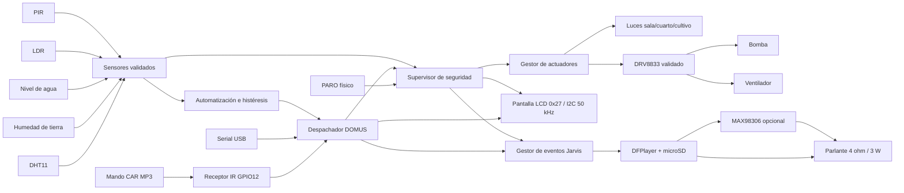
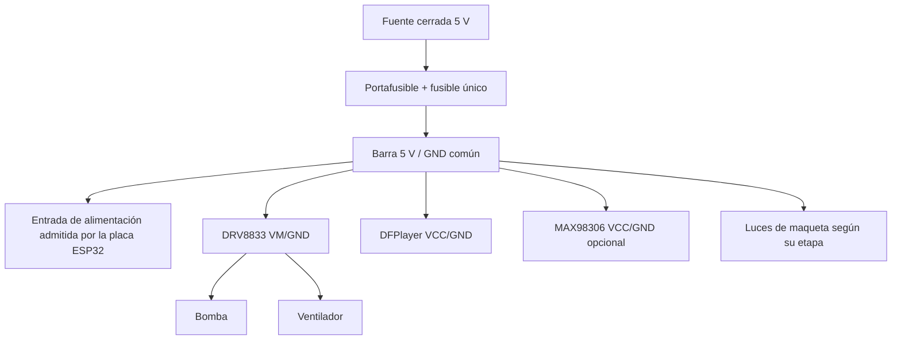
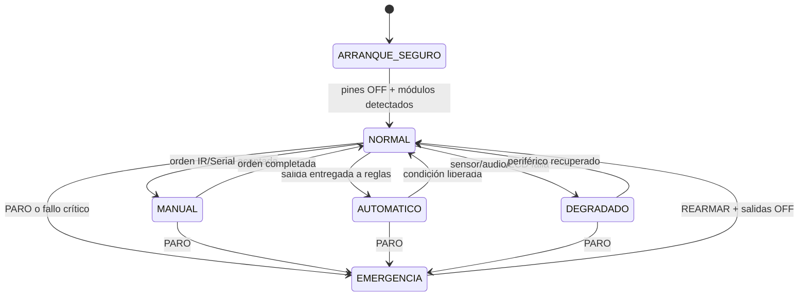

# Arquitectura final: software, hardware y funciones

## Resultado final esperado

DOMUS será una casa inteligente local gobernada por una ESP32-S3 N16R8. Leerá
temperatura/humedad ambiental, humedad de tierra, nivel de agua, iluminación y
presencia; manejará tres zonas de luz, bomba y ventilador; mostrará estado en el
LCD; recibirá órdenes del mando IR; y responderá con frases pregrabadas mediante
DFPlayer. No dependerá de Wi-Fi, nube, micrófono, IA ni reconocimiento de voz.

Habrá una sola base de firmware: `firmware/casa_inteligente_v4`. Los perfiles
seleccionarán hardware disponible sin duplicar la lógica doméstica:

- **Banco actual:** `BANCO_COMPLETO_S8050_IR`; bomba con S8050, ventilador
  bloqueado y audio deshabilitado.
- **Casa final:** perfil nuevo `CASA_FINAL_DRV8833_DFPLAYER`, que solo se creará
  después de identificar físicamente DRV8833, DFPlayer y GPIO libres.

## Diagrama funcional

El supervisor de seguridad es el único camino hacia bomba y ventilador. LCD y
audio muestran o anuncian resultados; nunca autorizan una salida.

## Diagrama de energía final

- El fusible se instala en serie, nunca en paralelo.
- Los capacitores se colocan respetando polaridad: barra principal, DRV8833 y
  audio. Su valor real se registra por la etiqueta de las piezas recibidas.
- Bomba/audio no toman corriente desde 3V3 ni desde un GPIO.
- Todas las ramas comparten GND; potencia de motores se mantiene separada de
  señales y audio en la baquelita.
- El TP4056 y S8050 quedan como herramientas del banco, no como potencia final.

## Módulos físicos del producto

| Bloque | Hardware | Función final | Estado actual |
|---|---|---|---|
| Cerebro | ESP32-S3 N16R8 | Ejecutar todo el control local | PASS |
| Pantalla | LCD1602 + backpack `0x27` | Datos, códigos IR, alertas y estados | PASS a 50 kHz |
| Entrada | Receptor IR + CAR MP3 | Control manual de 21 teclas | 21 códigos capturados |
| Clima | DHT11 | Temperatura y humedad del aire | NaN; reparar |
| Cultivo | Sensor resistivo de tierra | Porcentaje seco/húmedo | Falta calibración |
| Depósito | Sensor de nivel | Porcentaje y bloqueo de riego | Lectura inválida; revisar |
| Ambiente | LDR | Porcentaje de luz | Responde; calibrar |
| Presencia | PIR | Movimiento con retención | Responde; validar reposo |
| Iluminación | LED sala, cuarto y cultivo | Salidas manuales/automáticas | Banco disponible |
| Motores | DRV8833 doble | Canal A bomba, canal B ventilador | Esperando módulo/F1 |
| Voz | DFPlayer Mini + microSD | 56 frases Jarvis | Diseño listo; integrar |
| Amplificación | MAX98306 analógico | Amplificar DAC del DFPlayer si hace falta | Esperando/validar |
| Parlante | 4 Ω / 3 W | Salida audible | Esperando/validar |
| Potencia | Fuente 5 V, fusible, capacitores | Alimentación final protegida | Esperando/medir |
| Montaje | Baquelita, borneras y separadores | Instalación final | Después del banco |

## Mapa confirmado y reservas

| Función actual | GPIO | Destino final |
|---|---:|---|
| LDR | 3 | Se conserva |
| Bomba lógica de banco | 4 | Se reemplaza por backend DRV8833 |
| Luz sala | 5 | Se conserva |
| Luz cuarto | 6 | Se conserva |
| Ventilador lógico | 7 | Se reemplaza por backend DRV8833 |
| Luz cultivo | 8 | Se conserva |
| PIR | 9 | Se conserva |
| PARO | 10 | Se conserva |
| SILENCIO | 11 | Se conserva |
| IR | 12 | Se conserva |
| LCD SCL | 13 | Se conserva a 50 kHz |
| DHT11 | 14 | Se conserva tras reparar |
| Tierra AO | 15 | Se conserva |
| Nivel S | 16 | Se conserva |
| LCD SDA | 17 | Se conserva |
| MODO LCD | 18 | Se conserva |

El producto final todavía necesita asignar:

- DRV8833: `AIN1`, `AIN2`, `BIN1`, `BIN2` y quizá `nSLEEP`.
- DFPlayer: UART TX, UART RX y preferiblemente `BUSY`.

Esos pines quedan **TBD** hasta fotografiar la placa ESP32 y los módulos,
confirmar qué GPIO están expuestos y pasar la auditoría de colisiones. GPIO17 y
GPIO18 no vuelven a usarse para DFPlayer. GPIO4/7 solos no alcanzan para las
cuatro entradas de un puente H dual.

## Estructura lógica del firmware final

| Módulo lógico | Responsabilidad |
|---|---|
| `MapaPinesCasa` | Única fuente de GPIO y capacidades por perfil |
| Sensores | Muestreo, rango, filtro, porcentaje y último valor válido |
| Calibración/NVS | Seco-húmedo, vacío-lleno, oscuro-claro y checksum |
| Automatización | Histéresis de riego, luz y ventilación; presencia temporal |
| Despachador | Unificar órdenes IR, Serial, botones y automatización |
| Seguridad | PARO, nivel bajo, timeout, rearme, watchdog y modo seguro |
| Actuadores | Luces y backend de motor; lectura de estado aplicado |
| `PantallaFinal` | Vistas LCD, errores, lector IR y actualización diferencial |
| `IRCasa` | Aprendizaje de 21 teclas, NVS, repetición y códigos únicos |
| `JarvisAudio` | Evento→carpeta, variante aleatoria, prioridad y silencio |
| `DFPlayerTransport` | UART 9600, volumen, BUSY, errores y reproducción |
| Diagnóstico | `ESTADO`, `DIAGNOSTICO`, `PRUEBA` y evidencia HIL |

El `.ino` solo inicializa módulos y ejecuta sus `tick()` no bloqueantes. Ningún
módulo usa esperas largas dentro del ciclo normal.

## Estados del sistema

Un fallo de LCD, DFPlayer o sensor individual lleva a modo degradado y no para
la lógica segura. Nivel inválido sí bloquea la bomba. PARO apaga todo siempre.

## Funciones finales por subsistema

### Riego

- Manual: tecla 5 solicita encendido; tecla 0 apaga todo.
- Automático: tierra bajo umbral + nivel suficiente inicia riego.
- Se detiene por tierra húmeda, nivel bajo, timeout, PARO o fallo del driver.
- Jarvis anuncia carpeta `06`, `07` o `10` según resultado real.

### Ventilación

- Manual: tecla 4 alterna ventilador después de validar DRV8833.
- Automático: temperatura alta enciende; histéresis evita oscilación.
- DHT inválido bloquea automatización de ventilador sin afectar luces/IR.

### Iluminación

- Tecla 1/Anterior alterna sala; tecla 2/Siguiente alterna cuarto; tecla 3
  alterna cultivo.
- LDR y PIR pueden gobernar luces cuando su propietario sea `AUTOMATICO`.
- Cada cambio aceptado genera evento LCD, Serial y una frase Jarvis.

### Pantalla

- Vista 0: temperatura y humedad del aire.
- Vista 1: tierra y porcentaje de agua.
- Vista 2: luz y presencia.
- Vista 3: cinco salidas.
- Vista 4: seguridad/errores.
- Cada pulsación IR muestra protocolo, dirección y comando durante cinco
  segundos. CH-/CH navegan; MODO físico avanza.

### Jarvis y mando IR

- CH+ informa estado; EQ ejecuta diagnóstico; 200+ rearma; 0 apaga todo.
- PLAY alternará silencio/reproducción; VOL-/VOL+ ajustarán 0–30; 100+ repetirá
  la última frase cuando el audio esté habilitado.
- Las demás acciones conservan el mapa actual. Jarvis habla solo después del
  ACK/NACK del despachador, nunca antes.
- Catálogo, carpetas y selección aleatoria:
  [[65 - Arquitectura de audios Jarvis con DFPlayer]].

## Secuencia de arranque final

1. Configurar todas las salidas en OFF antes de iniciar periféricos.
2. Iniciar watchdog, PARO y controles físicos.
3. Iniciar I²C a 50 kHz y detectar LCD `0x27`.
4. Iniciar sensores; suspender DHT tras tres fallos NaN.
5. Cargar calibración e IR desde NVS, validando checksum/máscara.
6. Iniciar DRV8833 bloqueado; habilitarlo solo si backend y puerta F1 coinciden.
7. Iniciar DFPlayer; si falla, marcar `AUDIO_OFF` y continuar.
8. Mostrar sistema listo y reproducir carpeta `01` solo si audio está sano.
9. Mantener bomba y ventilador en manual OFF hasta una orden posterior.

## Orden de integración cuando lleguen los módulos

1. Fotografiar etiquetas y ambos lados de DRV8833, MAX98306 y DFPlayer.
2. Medir fuente y confirmar polaridad sin conectar ESP32.
3. Auditar GPIO finales y congelar un nuevo `MapaPinesCasa`.
4. Probar DRV8833 sin motores; después bomba y ventilador por separado.
5. Probar DFPlayer con `01/001.mp3`, volumen bajo y parlante compatible.
6. Integrar `JarvisAudio` primero con una luz; luego riego y alertas.
7. Ejecutar HIL con LCD, sensores, luces, ambos motores y audio.
8. Medir corriente/temperatura y elegir fusible; después soldar baquelita.
9. Congelar perfil final y generar el diagrama físico definitivo.

## Criterio de terminado

El software final no se declara listo solo porque compile. Requiere:

- todos los módulos identificados y sin colisiones de GPIO;
- calibraciones reales guardadas;
- LCD, 21 teclas IR y 56 MP3 verificados;
- bomba y ventilador probados por separado y con protecciones;
- desconexión de LCD/audio/sensor sin perder PARO ni dejar una salida activa;
- prueba HIL prolongada sin reinicios;
- diagrama final actualizado con los GPIO ya confirmados.

Hasta completar esas puertas, la casa operativa sigue usando el perfil de banco
y esta nota define el destino, no autoriza conexiones TBD.

Relacionadas: [[00 - Inicio]], [[63 - Auditoria total de Obsidian y estado real]],
[[64 - Sesion fisica COM9 LCD IR sensores y bomba]] y
[[65 - Arquitectura de audios Jarvis con DFPlayer]].
